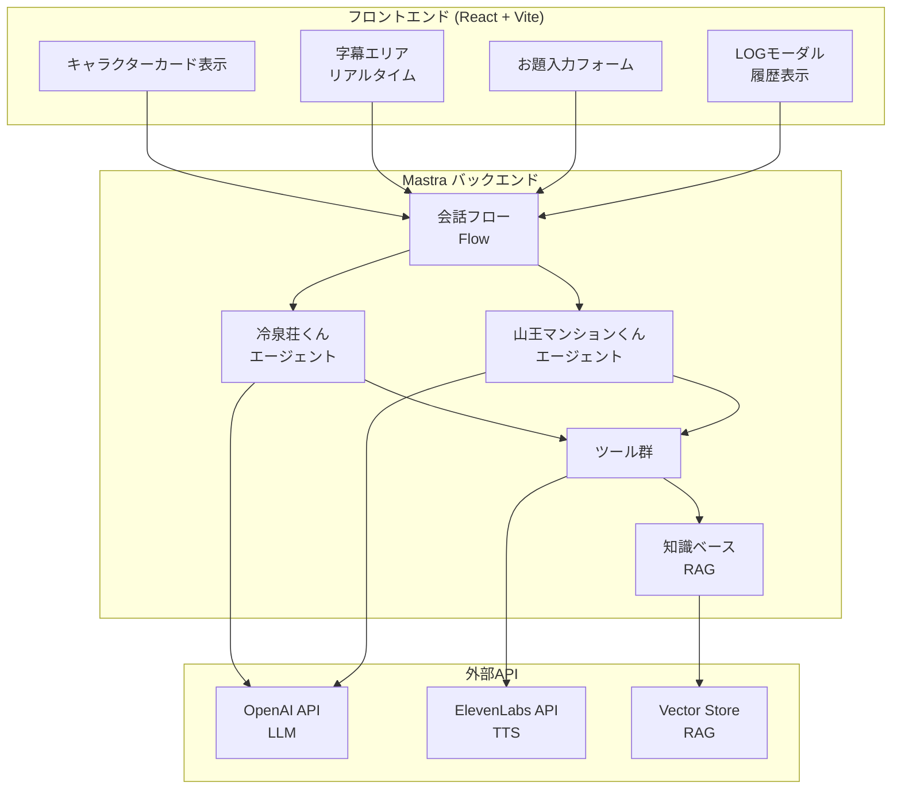
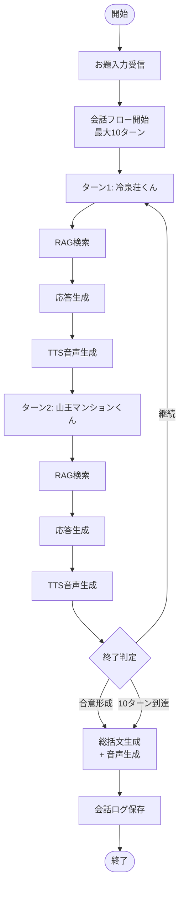
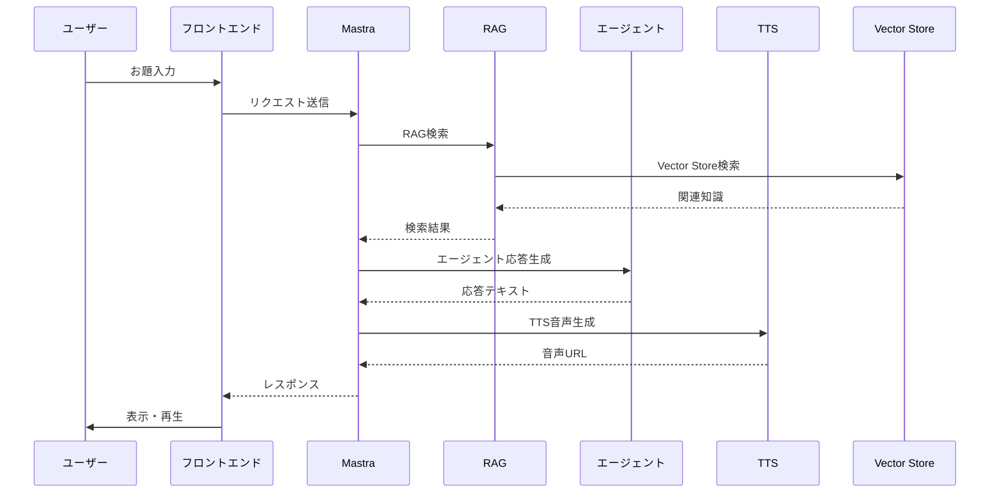
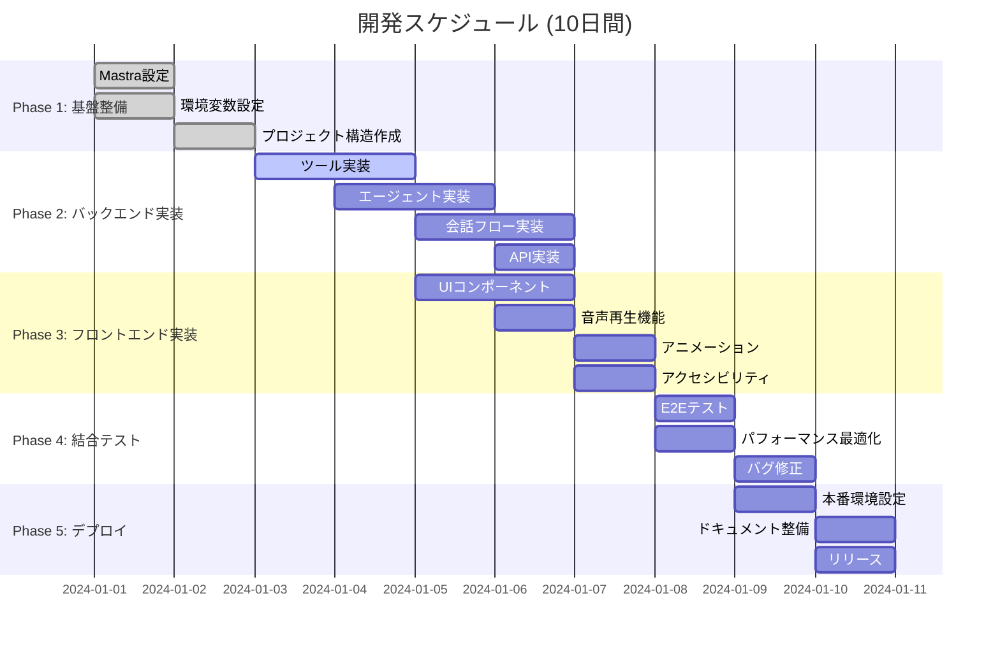
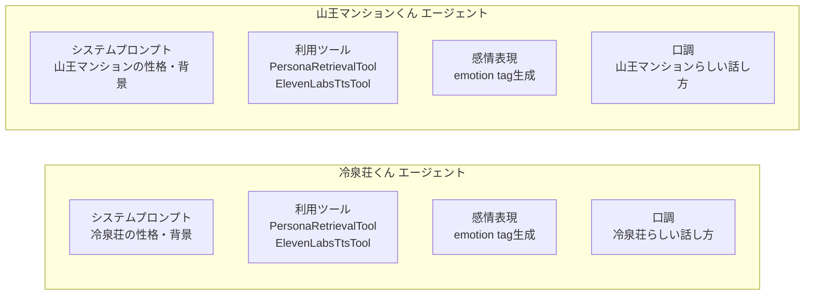
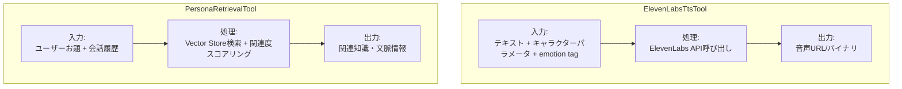

# プロジェクト構成図プレビュー

## 全体アーキテクチャ

```mermaid
graph TB
    subgraph "フロントエンド (React + Vite)"
        UI1[キャラクターカード表示]
        UI2[字幕エリア<br/>リアルタイム]
        UI3[お題入力フォーム]
        UI4[LOGモーダル<br/>履歴表示]
    end
    
    subgraph "Mastra バックエンド"
        FLOW[会話フロー<br/>Flow]
        AGENT1[冷泉荘くん<br/>エージェント]
        AGENT2[山王マンションくん<br/>エージェント]
        TOOLS[ツール群]
        RAG[知識ベース<br/>RAG]
    end
    
    subgraph "外部API"
        OPENAI[OpenAI API<br/>LLM]
        ELEVEN[ElevenLabs API<br/>TTS]
        VECTOR[Vector Store<br/>RAG]
    end
    
    UI1 --> FLOW
    UI2 --> FLOW
    UI3 --> FLOW
    UI4 --> FLOW
    
    FLOW --> AGENT1
    FLOW --> AGENT2
    AGENT1 --> TOOLS
    AGENT2 --> TOOLS
    TOOLS --> RAG
    
    AGENT1 --> OPENAI
    AGENT2 --> OPENAI
    TOOLS --> ELEVEN
    RAG --> VECTOR
```

## 会話フロー詳細

```mermaid
flowchart TD
    START([開始]) --> INPUT[お題入力受信]
    INPUT --> FLOW_START[会話フロー開始<br/>最大10ターン]
    
    FLOW_START --> TURN1[ターン1: 冷泉荘くん]
    TURN1 --> RAG1[RAG検索]
    RAG1 --> RESPONSE1[応答生成]
    RESPONSE1 --> TTS1[TTS音声生成]
    TTS1 --> TURN2[ターン2: 山王マンションくん]
    
    TURN2 --> RAG2[RAG検索]
    RAG2 --> RESPONSE2[応答生成]
    RESPONSE2 --> TTS2[TTS音声生成]
    TTS2 --> CHECK{終了判定}
    
    CHECK -->|合意形成| SUMMARY[総括文生成<br/>+ 音声生成]
    CHECK -->|10ターン到達| SUMMARY
    CHECK -->|継続| TURN1
    
    SUMMARY --> LOG[会話ログ保存]
    LOG --> END([終了])
```

## データフロー

```mermaid
sequenceDiagram
    participant U as ユーザー
    participant F as フロントエンド
    participant M as Mastra
    participant R as RAG
    participant A as エージェント
    participant T as TTS
    participant V as Vector Store
    
    U->>F: お題入力
    F->>M: リクエスト送信
    M->>R: RAG検索
    R->>V: Vector Store検索
    V-->>R: 関連知識
    R-->>M: 検索結果
    M->>A: エージェント応答生成
    A-->>M: 応答テキスト
    M->>T: TTS音声生成
    T-->>M: 音声URL
    M-->>F: レスポンス
    F->>U: 表示・再生
```

## 開発フェーズ

```mermaid
gantt
    title 開発スケジュール (10日間)
    dateFormat  YYYY-MM-DD
    section Phase 1: 基盤整備
    Mastra設定           :done, p1-1, 2024-01-01, 1d
    環境変数設定         :done, p1-2, 2024-01-01, 1d
    プロジェクト構造作成 :done, p1-3, 2024-01-02, 1d
    
    section Phase 2: バックエンド実装
    ツール実装          :active, p2-1, 2024-01-03, 2d
    エージェント実装    :p2-2, 2024-01-04, 2d
    会話フロー実装      :p2-3, 2024-01-05, 2d
    API実装             :p2-4, 2024-01-06, 1d
    
    section Phase 3: フロントエンド実装
    UIコンポーネント    :p3-1, 2024-01-05, 2d
    音声再生機能        :p3-2, 2024-01-06, 1d
    アニメーション      :p3-3, 2024-01-07, 1d
    アクセシビリティ    :p3-4, 2024-01-07, 1d
    
    section Phase 4: 結合テスト
    E2Eテスト           :p4-1, 2024-01-08, 1d
    パフォーマンス最適化 :p4-2, 2024-01-08, 1d
    バグ修正            :p4-3, 2024-01-09, 1d
    
    section Phase 5: デプロイ
    本番環境設定        :p5-1, 2024-01-09, 1d
    ドキュメント整備    :p5-2, 2024-01-10, 1d
    リリース            :p5-3, 2024-01-10, 1d
```

## エージェント構成

```mermaid
graph LR
    subgraph "冷泉荘くん エージェント"
        R1[システムプロンプト<br/>冷泉荘の性格・背景]
        R2[利用ツール<br/>PersonaRetrievalTool<br/>ElevenLabsTtsTool]
        R3[感情表現<br/>emotion tag生成]
        R4[口調<br/>冷泉荘らしい話し方]
    end
    
    subgraph "山王マンションくん エージェント"
        S1[システムプロンプト<br/>山王マンションの性格・背景]
        S2[利用ツール<br/>PersonaRetrievalTool<br/>ElevenLabsTtsTool]
        S3[感情表現<br/>emotion tag生成]
        S4[口調<br/>山王マンションらしい話し方]
    end
```

## ツール構成

```mermaid
graph TB
    subgraph "ElevenLabsTtsTool"
        TTS_IN[入力:<br/>テキスト + キャラクターパラメータ + emotion tag]
        TTS_PROCESS[処理:<br/>ElevenLabs API呼び出し]
        TTS_OUT[出力:<br/>音声URL/バイナリ]
        TTS_IN --> TTS_PROCESS --> TTS_OUT
    end
    
    subgraph "PersonaRetrievalTool"
        RAG_IN[入力:<br/>ユーザーお題 + 会話履歴]
        RAG_PROCESS[処理:<br/>Vector Store検索 + 関連度スコアリング]
        RAG_OUT[出力:<br/>関連知識・文脈情報]
        RAG_IN --> RAG_PROCESS --> RAG_OUT
    end
```
